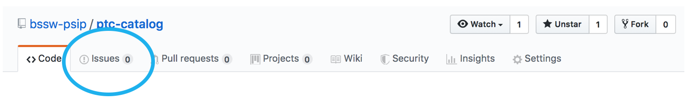
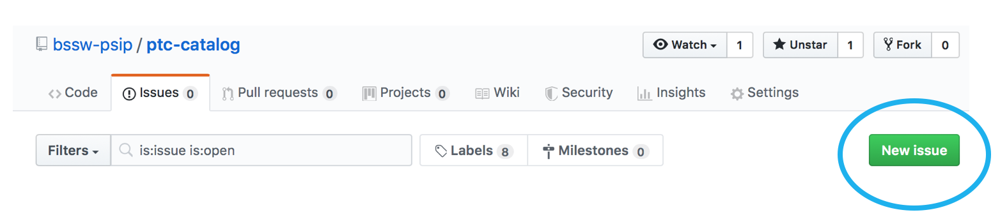
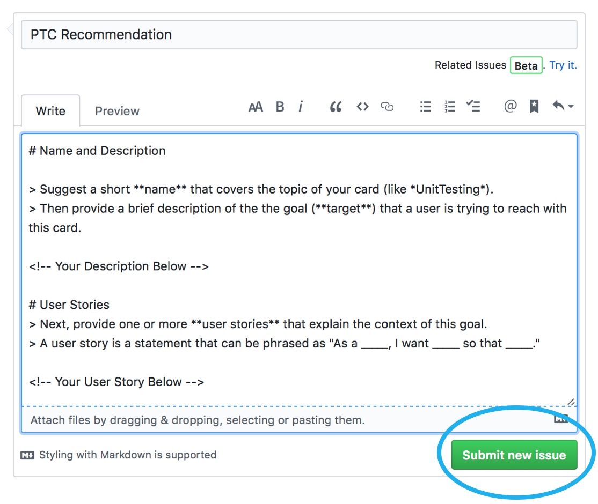
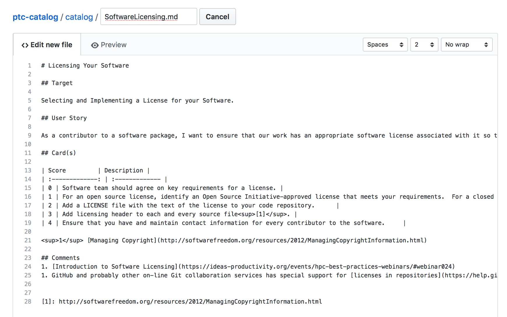

# How To Contribute

Thank you for your willingness to contribute additional progress tracking cards to our catalog! There are two ways to do this: (1) by creating an card submission issue and (2) as a pull request.

## How To Submit A PTC as a GitHub Issue

1. Select **Issues**.

2. Select **Create New Issue**.

3. Find the *Card Submission* issue template and click **Get Started**

4. Follow the instructions and add your content in the sections provided, then click **Submit New Issue**.

## How to Submit a PTC as a Pull Request

1. Create a fork of the PTC catalog repository.

2. On the Fork, in the catalog directory, create a new file for your card.

Copy and paste the content of your card into the dialog box. The file should have a descriptive name with the markdown extension (e.g. SoftwareLicensing.md, PerformanceRegressionTesting.md). Commit the new file to the fork.

3. Follow [these instructions](https://help.github.com/en/github/collaborating-with-issues-and-pull-requests/creating-a-pull-request-from-a-fork) to create a pull request from the fork.
